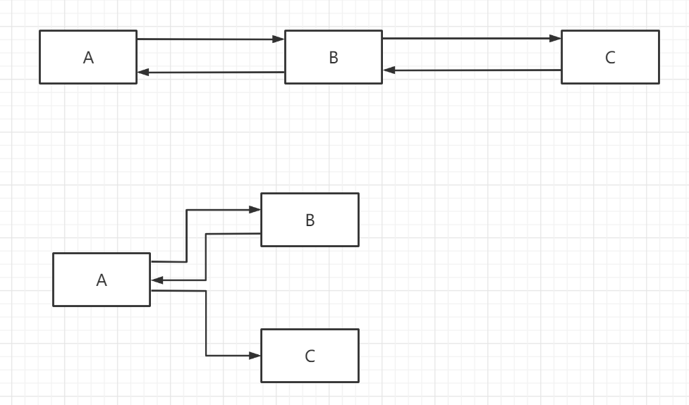
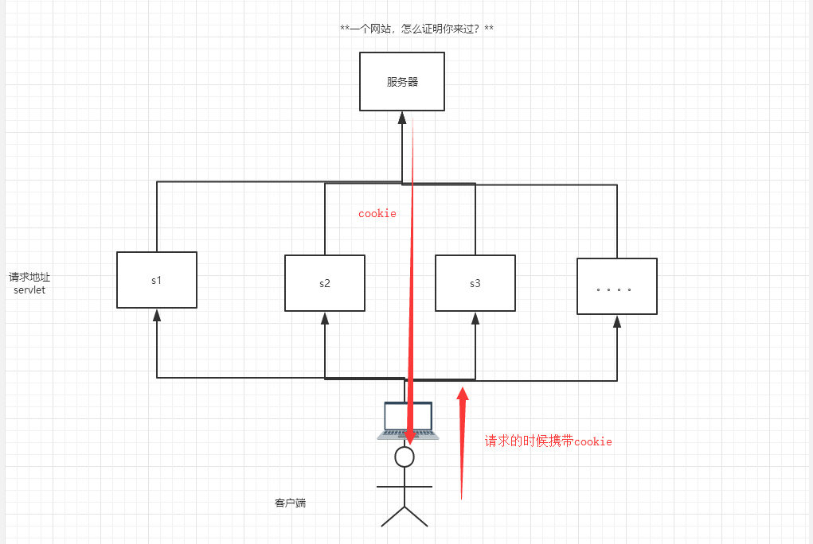
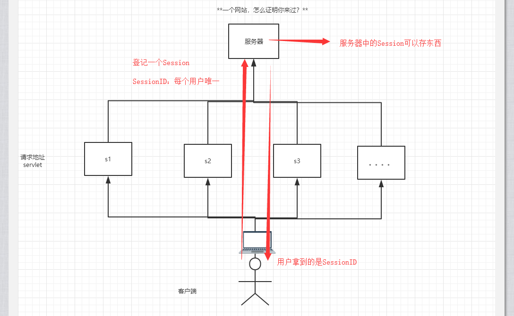
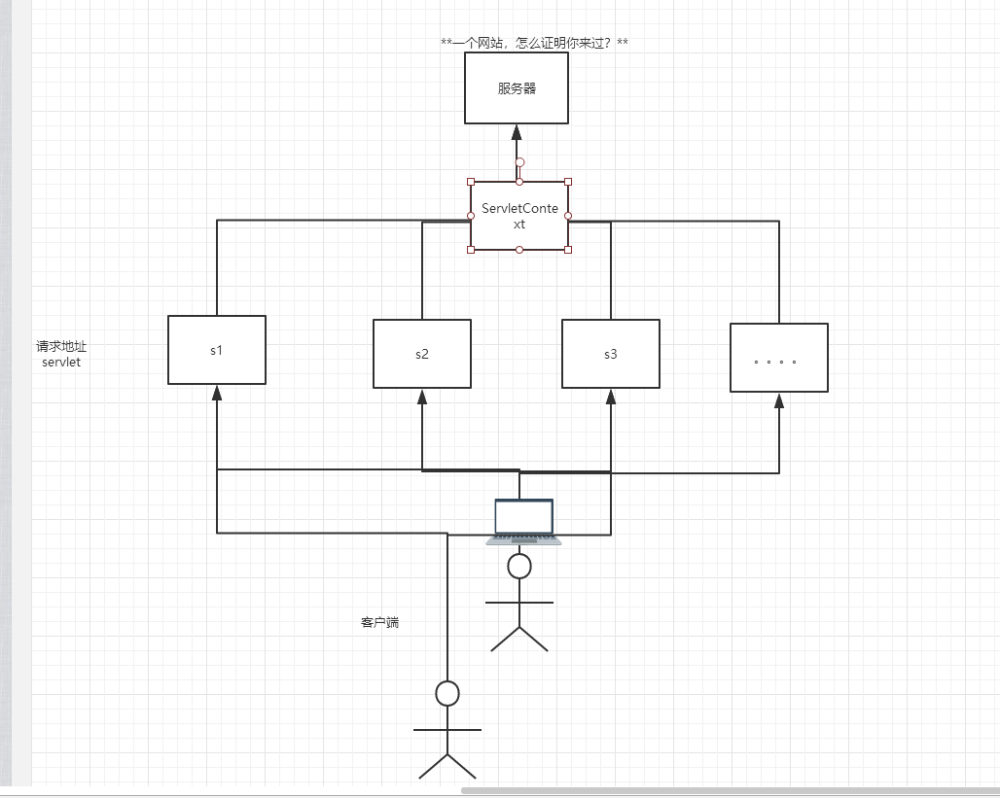
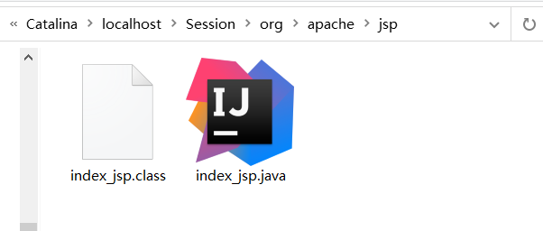
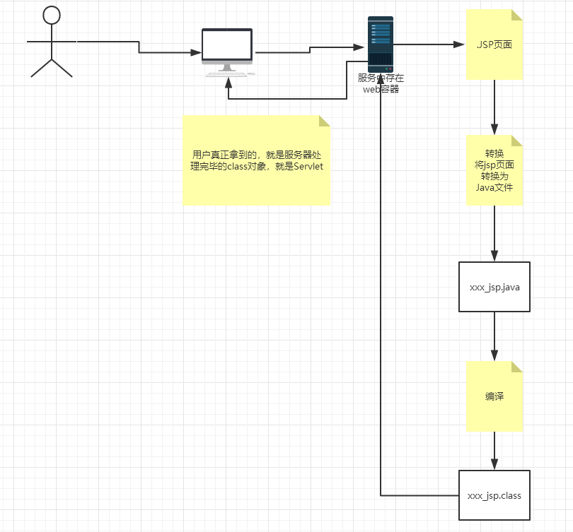
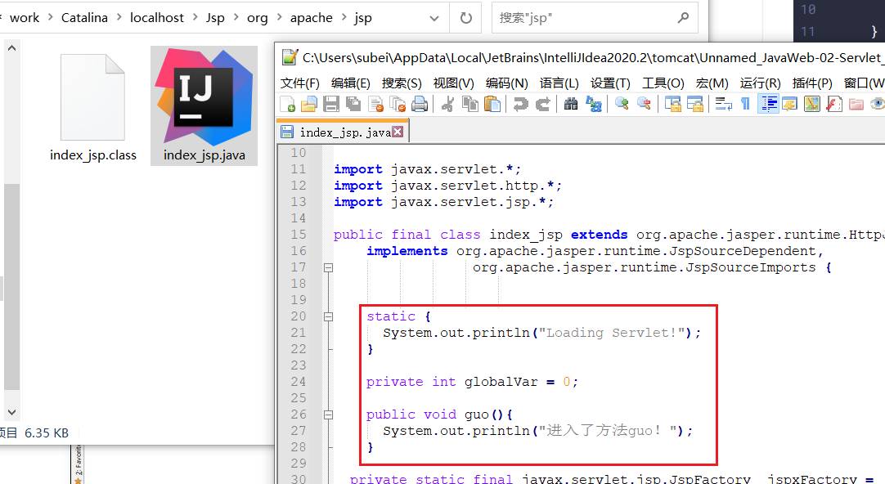
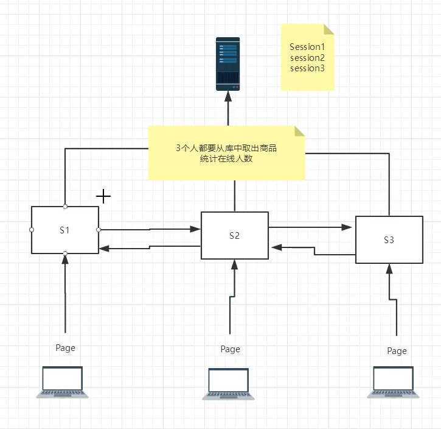

# JavaWeb

Web技术宽泛理解就是有的人提供了别人可以访问到的东西。可以是文件服务器，这种只要称之为访问的东西。

Web技术狭义来讲就指现在通过HTTP，HTTPS，RPC协议访问的。可以是Browser/Server 可以是Client/Server。

### 静态web
  * 写死的html，无法进行数据交互
### 动态web
  * 可以登录，可以进行数据交互，可以提供给不同人不同的页面
  * 现在动态web技术有Servlet/JSP(Java), ASP.NET(Microsoft), PHP, Django(Python Web), Flask(Python Web)

## Web服务器

实现整个web访问行为，其实是可以做到完全纯java来做，用socket编程即可，但是仅仅是处理物理机接口，并发管理，这些复杂情况就要耗费很多代码，因此一般抽象出web服务器软件，软件再封装提供成例如servlet的接口给开发者。会方便很多。

### IIS

微软开发，提供ASP接口，在windows操作系统中自带并捆绑

### Tomcat

Apache项目，提供Servlet和JSP接口，后续改名Jakarta。

#### tomcat使用

安装推荐解压缩方式，干净整洁。流程与linux保持一直。

需要配置JAVA环境变量。

- 可以配置启动的端口号
    - Tomcat的默认端口号为：8080
    - mysql：3306
    - http：80
    - https：443

```xml
<Connector port="8081" protocol="HTTP/1.1"
               connectionTimeout="20000"
               redirectPort="8443" />
```

- 可以配置主机的名称
    - 默认的主机名为：localhost->127.0.0.1
    - 默认网站应用存放的位置为：webapps

```xml
<Host name="www.iris.com"  appBase="webapps"
            unpackWARs="true" autoDeploy="true">
```

#### webapps文件夹

写好的服务器放置在webapps文件夹下，开启tomcat可自动启动。

- 网站应该有的结构

```
--webapps ：Tomcat服务器的web目录
	-ROOT
	-books ：网站的目录名
		- WEB-INF
			-classes : java程序
			-lib：web应用所依赖的jar包
			-web.xml ：网站配置文件
		- index.html 默认的首页
		- static 
            -css
            	-style.css
            -js
            -img
         -.....
```

## Maven

Maven是一种项目架构管理工具。方便导入包。类似功能其他产品还有Gradle，常用于谷歌安卓开发。

Maven不需要环境变量可以使用，但是建议配置。配置后可以让IDEA等工具自动识别。path中有maven\bin即可

可以在terminal中`mvn -version`测试

普通maven项目结构是
```
--root : 项目根目录
    -src
        -main : pom配置文件，管理导包，编译war还是jar。
            -java
                -com.iris
            -resources : spring mybatis等配置文件，以及一切配置文件
        -test : 测试包
            -java
                -com.iris : 专业项目的测试类与原类一一对应
    pom.xml : pom配置文件，管理导包，编译war还是jar。
```

maven web
```
--root : 项目根目录
    -src
        -main : pom配置文件，管理导包，编译war还是jar。
            -java
                -com.iris
            -webapp : maven web特有的文件夹。
                -WEB-INF
                    web.xml  : 存放前端文件和前后端配置绑定文件
                index.jsp
        -test : 测试包
            -java
                -com.iris : 专业项目的测试类与原类一一对应
    pom.xml : pom配置文件，管理导包，编译war还是jar。maven web自动生成的jar也不同，有<url></url>等独特的标记
```

#### IDEA中绑定Tomcat

1. 在application server中绑定文件根地址，不是bin地址，是bin的上一级
2. 在同一地方，找到Deployment，添加组件。可以选择explored热插拔模式(有局限)。
3. 在Application context配置url

#### pom文件

> pom.xml是Maven的核心配置文件。

```xml
<?xml version="1.0" encoding="UTF-8"?>

<!--Maven版本和头文件-->
<project xmlns="http://maven.apache.org/POM/4.0.0" xmlns:xsi="http://www.w3.org/2001/XMLSchema-instance"
  xsi:schemaLocation="http://maven.apache.org/POM/4.0.0 http://maven.apache.org/xsd/maven-4.0.0.xsd">
  <modelVersion>4.0.0</modelVersion>

  <!--这里就是我们刚才配置的GAV-->
  <groupId>com.github</groupId>
  <artifactId>Javaweb-01-maven</artifactId>
  <version>1.0-SNAPSHOT</version>
  <!--Package：项目的打包方式
  jar：java应用
  war：JavaWeb应用
  -->
  <packaging>war</packaging>

  <!--配置-->
  <properties>
    <!--项目的默认构建编码-->
    <project.build.sourceEncoding>UTF-8</project.build.sourceEncoding>
    <!--编码版本-->
    <maven.compiler.source>1.8</maven.compiler.source>
    <maven.compiler.target>1.8</maven.compiler.target>
  </properties>

  <!--项目依赖-->
  <dependencies>
    <!--具体依赖的jar包配置文件-->
    <dependency>
      <groupId>junit</groupId>
      <artifactId>junit</artifactId>
      <version>4.11</version>
      <scope>test</scope>
    </dependency>
    <dependency>
      <groupId>javax.servlet</groupId>
      <artifactId>javax.servlet-api</artifactId>
      <version>4.0.1</version>
      <scope>provided</scope>
    </dependency>
  </dependencies>

  <!--项目构建用的东西-->
  <build>
    <finalName>Javaweb-01-maven</finalName>
    <pluginManagement><!-- lock down plugins versions to avoid using Maven defaults (may be moved to parent pom) -->
      <plugins>
        <plugin>
          <artifactId>maven-clean-plugin</artifactId>
          <version>3.1.0</version>
        </plugin>
        <!-- see http://maven.apache.org/ref/current/maven-core/default-bindings.html#Plugin_bindings_for_war_packaging -->
        <plugin>
          <artifactId>maven-resources-plugin</artifactId>
          <version>3.0.2</version>
        </plugin>
        <plugin>
          <artifactId>maven-compiler-plugin</artifactId>
          <version>3.8.0</version>
        </plugin>
        <plugin>
          <artifactId>maven-surefire-plugin</artifactId>
          <version>2.22.1</version>
        </plugin>
        <plugin>
          <artifactId>maven-war-plugin</artifactId>
          <version>3.2.2</version>
        </plugin>
        <plugin>
          <artifactId>maven-install-plugin</artifactId>
          <version>2.5.2</version>
        </plugin>
        <plugin>
          <artifactId>maven-deploy-plugin</artifactId>
          <version>2.8.2</version>
        </plugin>
      </plugins>
    </pluginManagement>
  </build>
</project>
```

> maven由于他的约定大于配置，我们之后可以能遇到我们写的配置文件，无法被导出或者生效的问题，解决方案：

```xml
<!--在build中配置resources，来防止资源导出失败的问题-->
<build>
    <resources>
        <resource>
            <directory>src/main/resources</directory>
            <includes>
                <include>**/*.properties</include>
                <include>**/*.xml</include>
            </includes>
            <filtering>true</filtering>
        </resource>
        <resource>
            <directory>src/main/java</directory>
            <includes>
                <include>**/*.properties</include>
                <include>**/*.xml</include>
            </includes>
            <filtering>true</filtering>
        </resource>
    </resources>
</build>
```

### maven默认web项目中的web.xml版本问题。

```xml
<!DOCTYPE web-app PUBLIC
        "-//Sun Microsystems, Inc.//DTD Web Application 2.3//EN"
        "http://java.sun.com/dtd/web-app_2_3.dtd" >

<web-app>
  <display-name>Archetype Created Web Application</display-name>
</web-app>
```

建议替换为webapp4.0版本和tomcat一致。

   ```xml
<?xml version="1.0" encoding="UTF-8"?>
<web-app xmlns="http://xmlns.jcp.org/xml/ns/javaee"
         xmlns:xsi="http://www.w3.org/2001/XMLSchema-instance"
         xsi:schemaLocation="http://xmlns.jcp.org/xml/ns/javaee
                        http://xmlns.jcp.org/xml/ns/javaee/web-app_4_0.xsd"
         version="4.0"
         metadata-complete="true">
   
</web-app>
   ```

## Servlet

sun公司开发的Tomcat接口叫Servlet。

**把实现了Servlet接口的Java程序叫做，Servlet**。

> Servlet接口Sun公司有两个默认的实现类：HttpServlet，GenericServlet。

写一个类继承HttpServlet即可

```java
package com.iris.servlet;

import javax.servlet.ServletException;
import javax.servlet.http.HttpServlet;
import javax.servlet.http.HttpServletRequest;
import javax.servlet.http.HttpServletResponse;
import java.io.IOException;
import java.io.PrintWriter;

public class HelloServlet extends HttpServlet {
    // 由于get或post只是请求实现的不同的方式，可以相互调用，业务逻辑都是一样；
    @Override
    protected void doGet(HttpServletRequest req, HttpServletResponse resp)
            throws ServletException, IOException, IOException {
        // ServletOutputStream outputStream = resp.getOutputStream();
        PrintWriter writer = resp.getWriter();  // 响应流
        writer.print("Hello, Servlet");
    }

    @Override
    protected void doPost(HttpServletRequest req, HttpServletResponse resp)
            throws ServletException, IOException, ServletException {
        super.doPost(req, resp);
    }
}
```

编写Servlet的映射在web.xml中

```xml
 <!--注册Servlet-->
    <servlet>
        <servlet-name>hello</servlet-name>
        <servlet-class>com.iris.servlet.HelloServlet</servlet-class>
    </servlet>
    <!--Servlet的请求路径-->
    <servlet-mapping>
        <servlet-name>hello</servlet-name>
        <url-pattern>/hello</url-pattern>
    </servlet-mapping>
```

### Mapping映射

1. 一个Servlet可以指定一个映射路径。

   ```xml
       <servlet-mapping>
           <servlet-name>hello</servlet-name>
           <url-pattern>/hello</url-pattern>
       </servlet-mapping>
   ```

2. 一个Servlet可以指定多个映射路径。

   ```xml
       <servlet-mapping>
           <servlet-name>hello</servlet-name>
           <url-pattern>/hello</url-pattern>
       </servlet-mapping>
       <servlet-mapping>
           <servlet-name>hello</servlet-name>
           <url-pattern>/hello2</url-pattern>
       </servlet-mapping>
       <servlet-mapping>
           <servlet-name>hello</servlet-name>
           <url-pattern>/hello3</url-pattern>
       </servlet-mapping>
       <servlet-mapping>
           <servlet-name>hello</servlet-name>
           <url-pattern>/hello4</url-pattern>
       </servlet-mapping>
       <servlet-mapping>
           <servlet-name>hello</servlet-name>
           <url-pattern>/hello5</url-pattern>
       </servlet-mapping>
   ```

3. 一个Servlet可以指定通用映射路径。

   ```xml
       <servlet-mapping>
           <servlet-name>hello</servlet-name>
           <url-pattern>/hello/*</url-pattern>
       </servlet-mapping>
   ```

4. 默认请求路径。

   ```xml
       <!--默认请求路径-->
       <servlet-mapping>
           <servlet-name>hello</servlet-name>
           <url-pattern>/*</url-pattern>
       </servlet-mapping>
   ```

5. 指定一些后缀或者前缀等等….

   ```xml
       <!-- 可以自定义后缀实现请求映射
            注意点，*前面不能加项目映射的路径
            hello/subei.github
           -->
       <servlet-mapping>
           <servlet-name>hello</servlet-name>
           <url-pattern>*.github</url-pattern>
       </servlet-mapping>
   ```

6. 优先级问题。

  - 指定了固有的映射路径优先级最高，如果找不到就会走默认的处理请求；

   ```java
   package com.github.servlet;
   
   import javax.servlet.ServletException;
   import javax.servlet.http.HttpServletRequest;
   import javax.servlet.http.HttpServletResponse;
   import java.io.IOException;
   import java.io.PrintWriter;
   
   public class ErrorServelt extends HelloServlet{
       @Override
       protected void doGet(HttpServletRequest req, HttpServletResponse resp) throws ServletException, IOException {
           resp.setContentType("text/html");
           resp.setCharacterEncoding("utf-8");
   
           PrintWriter writer = resp.getWriter();
           writer.println("<h1>404</h1>");
       }
   
       @Override
       protected void doPost(HttpServletRequest req, HttpServletResponse resp) throws ServletException, IOException {
           super.doPost(req, resp);
       }
   }
   ```

   ```xml
   <!--  404  -->
       <servlet>
           <servlet-name>error</servlet-name>
           <servlet-class>com.github.servlet.ErrorServlet</servlet-class>
       </servlet>
       <servlet-mapping>
           <servlet-name>error</servlet-name>
           <url-pattern>/*</url-pattern>
       </servlet-mapping>
   ```

### ServletContext

web容器在启动的时候，它会为每个web程序都创建一个对应的ServletContext对象，ServletContext是服务器，每个服务器只会有一个ServletContext。

- 共享数据

ServletContext可以存储数据，在这个Servlet中保存的数据，可以在另外一个servlet中拿到,例子GetServlet，SetServlet体现

- 获取初始化参数

web.xml中可以配置context-param。作为初始化参数。

```xml
<!-- 配置一些Web应用初始化参数 -->
    <context-param>
        <param-name>url</param-name>
        <param-value>jdbc:mysql://localhost:3306/mybatis</param-value>
    </context-param>
    <context-param>
        <param-name>Name</param-name>
        <param-value>NMSL</param-value>
    </context-param>

```

类中获取

```java
        ServletContext context = this.getServletContext();
        String url = context.getInitParameter("url");
        resp.getWriter().print(url);
```

- 请求转发

```java
        ServletContext context = this.getServletContext();
        // 转发的请求路径
        // RequestDispatcher requestDispatcher = context.getRequestDispatcher("/gp");
        // 调用forward实现请求转发;
        // requestDispatcher.forward(req,resp);
        context.getRequestDispatcher("/getInit").forward(req,resp);
```

- 读取资源文件

```java
        InputStream is = this.getServletContext().getResourceAsStream("/WEB-INF/classes/com/github/servlet/aa.properties");

        Properties prop = new Properties();
        prop.load(is);
        String user = prop.getProperty("username");
        String pwd = prop.getProperty("password");

        resp.getWriter().print(user+":"+pwd);
```

这里需要注意文件的地址，可以在target文件夹(编译后的地方)里找，该文件在项目中的resources里，编译后在/WEB-INF/classes/内

### HttpServletResponse

- web服务器接收到客户端的http请求，针对这个请求，分别创建一个代表请求的HttpServletRequest对象，代表响应的一个HttpServletResponse；

  - 如果要获取客户端请求过来的参数：找HttpServletRequest
  - 如果要给客户端响应一些信息：找HttpServletResponse

- 响应的状态码。

```java
    int SC_CONTINUE = 100;
    int SC_SWITCHING_PROTOCOLS = 101;
    int SC_OK = 200;
    int SC_CREATED = 201;
    int SC_ACCEPTED = 202;
    int SC_NON_AUTHORITATIVE_INFORMATION = 203;
    int SC_NO_CONTENT = 204;
    int SC_RESET_CONTENT = 205;
    int SC_PARTIAL_CONTENT = 206;
    int SC_MULTIPLE_CHOICES = 300;
    int SC_MOVED_PERMANENTLY = 301;
    int SC_MOVED_TEMPORARILY = 302;
    int SC_FOUND = 302;
    int SC_SEE_OTHER = 303;
    int SC_NOT_MODIFIED = 304;
    int SC_USE_PROXY = 305;
    int SC_TEMPORARY_REDIRECT = 307;
    int SC_BAD_REQUEST = 400;
    int SC_UNAUTHORIZED = 401;
    int SC_PAYMENT_REQUIRED = 402;
    int SC_FORBIDDEN = 403;
    int SC_NOT_FOUND = 404;
    int SC_METHOD_NOT_ALLOWED = 405;
    int SC_NOT_ACCEPTABLE = 406;
    int SC_PROXY_AUTHENTICATION_REQUIRED = 407;
    int SC_REQUEST_TIMEOUT = 408;
    int SC_CONFLICT = 409;
    int SC_GONE = 410;
    int SC_LENGTH_REQUIRED = 411;
    int SC_PRECONDITION_FAILED = 412;
    int SC_REQUEST_ENTITY_TOO_LARGE = 413;
    int SC_REQUEST_URI_TOO_LONG = 414;
    int SC_UNSUPPORTED_MEDIA_TYPE = 415;
    int SC_REQUESTED_RANGE_NOT_SATISFIABLE = 416;
    int SC_EXPECTATION_FAILED = 417;
    int SC_INTERNAL_SERVER_ERROR = 500;
    int SC_NOT_IMPLEMENTED = 501;
    int SC_BAD_GATEWAY = 502;
    int SC_SERVICE_UNAVAILABLE = 503;
    int SC_GATEWAY_TIMEOUT = 504;
    int SC_HTTP_VERSION_NOT_SUPPORTED = 505;
```

#### 下载文件

1. 向浏览器输出消息；
2. 下载文件：
    1. 要获取下载文件的路径
    2. 下载的文件名是啥
    3. 设置想办法让浏览器能够支持下载我们需要的东西
    4. 获取下载文件的输入流
    5. 创建缓冲区
    6. 获取OutputStream对象
    7. 将FileOutputStream流写入到buffer缓冲区
    8. 使用OutputStream将缓冲区中的数据输出到客户端

#### 3.验证码功能

- 验证怎么生成:
    - 前端实现
    - 后端实现，需要用到 Java 的图片类，生产一个图片

```java
package com.iris.servlet;

import javax.imageio.ImageIO;
import javax.servlet.ServletException;
import javax.servlet.http.HttpServlet;
import javax.servlet.http.HttpServletRequest;
import javax.servlet.http.HttpServletResponse;
import java.awt.*;
import java.awt.image.BufferedImage;
import java.io.IOException;
import java.util.Random;

public class ImageServlet extends HttpServlet {
    @Override
    protected void doGet(HttpServletRequest req, HttpServletResponse resp) throws IOException {
        // 如何让浏览器3秒自动刷新一次;
        resp.setHeader("refresh", "3");

        // 在内存中创建一个图片
        BufferedImage image = new BufferedImage(90, 40, BufferedImage.TYPE_INT_RGB);
        // 得到图片,笔
        Graphics2D g = (Graphics2D) image.getGraphics();
        // 设置图片的背景颜色
        g.setColor(Color.white);
        g.fillRect(0, 0, 90, 40);
        // 给图片写数据
        g.setColor(Color.RED);
        g.setFont(new Font(null, Font.BOLD, 20));
        g.drawString(makeNum(), 8, 30);

        // 告诉浏览器，这个请求用图片的方式打开
        resp.setContentType("image/jpeg");
        // 网站存在缓存，不让浏览器缓存
        resp.setDateHeader("expires", -1);
        resp.setHeader("Cache-Control", "no-cache");
        resp.setHeader("Pragma", "no-cache");

        // 把图片写给浏览器
        ImageIO.write(image, "jpg", resp.getOutputStream());

    }

    // 生成随机数
    private String makeNum() {
        Random random = new Random();
        String num = String.valueOf(random.nextInt(9999999));
        StringBuffer sb = new StringBuffer();
        for (int i = 0; i < 7 - num.length(); i++) {
            sb.append("0");
        }
        num = sb + num;
        return num;
    }

    @Override
    protected void doPost(HttpServletRequest req, HttpServletResponse resp) throws ServletException, IOException {
        super.doPost(req, resp);
    }
}
```

```xml
    <servlet>
        <servlet-name>img</servlet-name>
        <servlet-class>com.iris.servlet.ImageServlet</servlet-class>
    </servlet>
    <servlet-mapping>
        <servlet-name>img</servlet-name>
        <url-pattern>/img</url-pattern>
    </servlet-mapping>
```

#### 实现重定向

- B一个web资源收到客户端A请求后，B他会通知A客户端去访问另外一个web资源C，这个过程叫`重定向`。

重定向应用于
- 用户登录


> 面试题：请你聊聊重定向和转发的区别？

- 相同点：页面都会实现跳转；
- 不同点：
    - 请求转发的时候，url不会产生变化；
    - 重定向时候，url地址栏会发生变化；



#### 5.简单实现登录重定向


```jsp
<%--
    这里提交的路径需要寻找到项目的路径
    ${pageContext.request.contextPath} : 代表当前项目
--%>

<%@ page contentType="text/html;charset=UTF-8" language="java" %>
<html>
  <head>
    <title>登录</title>
  </head>
  <body>
  <form action="${pageContext.request.contextPath}/login" method="get">
    用户名:<input type="text" name="username"><br>
    密  码:<input type="password" name="password"><br>
    <input type="submit">
  </form>
  </body>
</html>
```

```JAVA
package com.github.servlet;

import javax.servlet.ServletException;
import javax.servlet.http.HttpServlet;
import javax.servlet.http.HttpServletRequest;
import javax.servlet.http.HttpServletResponse;
import java.io.IOException;

public class RequestTest extends HttpServlet {
    @Override
    protected void doGet(HttpServletRequest req, HttpServletResponse resp) throws ServletException, IOException {
        // 处理请求
        String username = req.getParameter("username");
        String password = req.getParameter("password");

        System.out.println(username+":"+password);

        // 重定向时需注意路径问题，否则为404;
        // /response/success.jsp
        resp.sendRedirect("/response/success.jsp");
    }

    @Override
    protected void doPost(HttpServletRequest req, HttpServletResponse resp) throws ServletException, IOException {
        super.doPost(req, resp);
    }
}
```

```xml
    <servlet>
        <servlet-name>/request</servlet-name>
        <servlet-class>com.github.servlet.RequestTest</servlet-class>
    </servlet>
    <servlet-mapping>
        <servlet-name>/request</servlet-name>
        <url-pattern>/login</url-pattern>
    </servlet-mapping>
```

```jsp
<%@ page contentType="text/html;charset=UTF-8" language="java" %>
<html>
<head>
    <title>成功</title>
</head>
<body>

<h1>登录成功！！！</h1>

</body>
</html>
```

### HttpServletRequest

- HttpServletRequest代表客户端的请求，用户通过Http协议访问服务器，HTTP请求中的所有信息会被封装到HttpServletRequest，通过这个HttpServletRequest的方法，获得客户端的所有信息；

request需要配合前端使用，让前端把参数传过来才能接受处理

```xml
    <form action="${pageContext.request.contextPath}/login" method="post">
        用户名：<input type="text" name="username"><br>
        密码：<input type="text" name="password"><br>
        爱好：
        <input type="checkbox" name="hobby" value="女孩">女孩
        <input type="checkbox" name="hobby" value="代码">代码
        <input type="checkbox" name="hobby" value="游戏">游戏
        <input type="checkbox" name="hobby" value="唱歌">唱歌
        <br>
        <input type="submit">
    </form>
```

前端有input，后端才能取到

```java
package com.iris.servlet;

import javax.servlet.ServletException;
import javax.servlet.http.HttpServlet;
import javax.servlet.http.HttpServletRequest;
import javax.servlet.http.HttpServletResponse;
import java.io.IOException;
import java.util.Arrays;

public class LoginServlet extends HttpServlet {
    @Override
    protected void doGet(HttpServletRequest req, HttpServletResponse resp) throws ServletException, IOException {
        req.setCharacterEncoding("UTF-8");
        resp.setCharacterEncoding("UTF-8");

        String username = req.getParameter("username");
        String password = req.getParameter("password");
        String[] hobbys = req.getParameterValues("hobbies");
        System.out.println("=============================");
        // 后台接收中文乱码问题
        System.out.println(username);
        System.out.println(password);
        System.out.println(Arrays.toString(hobbys));
        System.out.println("=============================");

        System.out.println(req.getContextPath());
        // 通过请求转发
        // 这里的 / 代表当前的web应用
        req.getRequestDispatcher("/success.jsp").forward(req,resp);
    }

    @Override
    protected void doPost(HttpServletRequest req, HttpServletResponse resp) throws ServletException, IOException {
        super.doPost(req, resp);
    }
}
```

## Cookie.Session

### 会话 Session

- **会话**：用户打开一个浏览器，点击了很多超链接，访问多个web资源，关闭浏览器，这个过程可以称之为会话；

- **有状态会话**：一个同学来过教室，下次再来教室，我们会知道这个同学，曾经来过，称之为有状态会话；

> **你能怎么证明你是西开的学生？**

```java
你              西开

1. 发票                西开给你发票
2. 学校登记             西开标记你来过了
```

> **一个网站，怎么证明你来过？**

```java
客户端              服务端

1. 服务端给客户端一个 信件，客户端下次访问服务端带上信件就可以了； cookie
2. 服务器登记你来过了，下次你来的时候我来匹配你； seesion
```

### 2.保存会话的两种技术

**cookie**

- 客户端技术   （响应，请求）

**session**

- 服务器技术，利用这个技术，可以保存用户的会话信息？ 我们可以把信息或者数据放在Session中！

> 常见常见：网站登录之后，你下次不用再登录了，第二次访问直接就上去了！

### 3.Cookie



1. 从请求中拿到cookie信息
2. 服务器响应给客户端cookie

```java
Cookie[] cookies = req.getCookies(); // 获得Cookie
cookie.getName(); // 获得cookie中的key
cookie.getValue(); // 获得cookie中的vlaue
new Cookie("lastLoginTime", System.currentTimeMillis()+""); // 新建一个cookie
cookie.setMaxAge(24*60*60); // 设置cookie的有效期
resp.addCookie(cookie); // 响应给客户端一个cookie
```

- **cookie：一般会保存在本地的 用户目录下 appdata；**
- 案例：

```java
package com.github.servlet;

import javax.servlet.ServletException;
import javax.servlet.http.Cookie;
import javax.servlet.http.HttpServlet;
import javax.servlet.http.HttpServletRequest;
import javax.servlet.http.HttpServletResponse;
import java.io.IOException;
import java.io.PrintWriter;
import java.util.Date;

/**
 * 保存用户上一次访问的时间
 */
public class CookieDemo01 extends HttpServlet {
    @Override
    protected void doGet(HttpServletRequest req, HttpServletResponse resp) throws ServletException, IOException {
        // 服务器，告诉你，你来的时间，将这个时间封装为一个信件
        // 解决中文乱码
        req.setCharacterEncoding("UTF-8");
        resp.setCharacterEncoding("UTF-8");
        resp.setContentType("text/html; charset=UTF-8");

        PrintWriter writer = resp.getWriter();

        // Cookie,服务端从客户端获取
        Cookie[] cookies = req.getCookies();
        // 这里返回数组，说明Cookie可能存在多个

        // 判断Cookie是否存在
        if(cookies!=null){
            // 如果存在，遍历数组
            writer.write("你上一次访问的时间是:");
            for (int i = 0; i < cookies.length; i++) {
                Cookie cookie = cookies[i];
                // 获取Cookie的名字
                if(cookie.getName().equals("lastLoginTime")) {
                    // 获得cookie中的value
                    long parseLong = Long.parseLong(cookie.getValue());
                    Date date = new Date(parseLong);
                    writer.write(date.toLocaleString());
                }
            }
        }else{
            writer.write("第一次访问本站！！！");
        }

        // 服务端给客户端响应一个Cookie;
        Cookie cookie = new Cookie("lastLoginTime", System.currentTimeMillis()+"");

        resp.addCookie(cookie);
    }

    @Override
    protected void doPost(HttpServletRequest req, HttpServletResponse resp) throws ServletException, IOException {
        super.doPost(req, resp);
    }
}
```

```xml
    <servlet>
        <servlet-name>/cookieDemo01</servlet-name>
        <servlet-class>com.github.servlet.CookieDemo01</servlet-class>
    </servlet>
    <servlet-mapping>
        <servlet-name>/cookieDemo01</servlet-name>
        <url-pattern>/cd01</url-pattern>
    </servlet-mapping>
```

> 一个网站cookie是否存在上限！**聊聊细节问题**。

- 一个Cookie只能保存一个信息；
- 一个web站点可以给浏览器发送多个cookie，最多存放20个cookie；
- Cookie大小有限制4kb；
- 300个cookie浏览器上限。

> **删除Cookie；**

- 不设置有效期，关闭浏览器，自动失效；
- 设置有效期时间为 0 ；

> **编码解码：**

```java
URLEncoder.encode("哇哈哈","utf-8")
URLDecoder.decode(cookie.getValue(),"UTF-8")
```

```java
package com.github.servlet;

import javax.servlet.ServletException;
import javax.servlet.http.Cookie;
import javax.servlet.http.HttpServlet;
import javax.servlet.http.HttpServletRequest;
import javax.servlet.http.HttpServletResponse;
import java.io.IOException;
import java.io.PrintWriter;
import java.net.URLDecoder;
import java.net.URLEncoder;
import java.util.Date;

/**
 * 中文数据传递
 */
public class CookieDemo03 extends HttpServlet {
    @Override
    protected void doGet(HttpServletRequest req, HttpServletResponse resp) throws ServletException, IOException {
        // 解决中文乱码
        req.setCharacterEncoding("UTF-8");
        resp.setCharacterEncoding("UTF-8");
        resp.setContentType("text/html; charset=UTF-8");

        PrintWriter writer = resp.getWriter();
        Cookie[] cookies = req.getCookies();

        // 判断Cookie是否存在
        if(cookies!=null){
            // 如果存在，遍历数组
            writer.write("你上一次访问的用户是:");
            for (int i = 0; i < cookies.length; i++) {
                Cookie cookie = cookies[i];
                // 获取Cookie的名字
                if(cookie.getName().equals("name")) {
                    // 解码
                    writer.write(URLDecoder.decode(cookie.getValue(),"UTF-8"));
                }
            }
        }else{
            writer.write("第一次访问本站！！！");
        }

        // 编码
        Cookie cookie = new Cookie("name", URLEncoder.encode("哇哈哈","UTF-8"));
        resp.addCookie(cookie);
    }

    @Override
    protected void doPost(HttpServletRequest req, HttpServletResponse resp) throws ServletException, IOException {
        super.doPost(req, resp);
    }
}
```

```xml
   <servlet>
        <servlet-name>/cookieDemo03</servlet-name>
        <servlet-class>com.github.servlet.CookieDemo03</servlet-class>
    </servlet>
    <servlet-mapping>
        <servlet-name>/cookieDemo03</servlet-name>
        <url-pattern>/cd03</url-pattern>
    </servlet-mapping>
```

### Session(重点)



> 什么是Session：

- 服务器会给每一个用户（浏览器）创建一个Seesion对象；
- 一个Seesion独占一个浏览器，只要浏览器没有关闭，这个Session就存在；
- 用户登录之后，整个网站它都可以访问！--> 保存用户的信息；保存购物车的信息…..

> Session和cookie的区别：

- Cookie是把用户的数据写给用户的浏览器，浏览器保存 （可以保存多个）
- Session把用户的数据写到用户独占Session中，服务器端保存  （保存重要的信息，减少服务器资源的浪费）
- Session对象由服务创建；

> 使用场景：

- 保存一个登录用户的信息；
- 购物车信息；
- 在整个网站中经常会使用的数据，我们将它保存在Session中；

> 使用Session：

```java
package com.github.pojo;

public class Person {
    private int age;
    private String name;

    public int getAge() {
        return age;
    }

    public void setAge(int age) {
        this.age = age;
    }

    public String getName() {
        return name;
    }

    public void setName(String name) {
        this.name = name;
    }

    public Person() {
    }

    public Person(String name, int age) {
        this.age = age;
        this.name = name;
    }

    @Override
    public String toString() {
        return "Person{" +
                "age=" + age +
                ", name='" + name + '\'' +
                '}';
    }
}
```

```java
package com.github.servlet;

import com.github.pojo.Person;

import javax.servlet.ServletException;
import javax.servlet.http.*;
import java.io.IOException;

public class SessionDemo01 extends HttpServlet {
    @Override
    protected void doGet(HttpServletRequest req, HttpServletResponse resp) throws ServletException, IOException {
        // 解决乱码问题
        req.setCharacterEncoding("UTF-8");
        resp.setCharacterEncoding("UTF-8");
        resp.setContentType("text/html; charset=UTF-8");

        // 得到Session
        HttpSession session = req.getSession();
        // 在session中存东西
        session.setAttribute("name",new Person("懒羊羊",1));
        // 获取Session中的ID
        String id = session.getId();

        // 判断Session是否为新创建的
        if(session.isNew()){
            resp.getWriter().write("session创建成功！ID:" + id);
        }else{
            resp.getWriter().write("session已经在服务器中存在了！ID:" + id);
        }

        // Session创建的时候做了什么事情:
//        Cookie cookie = new Cookie("JSESSIONID", id);
//        resp.addCookie(cookie);
    }

    @Override
    protected void doPost(HttpServletRequest req, HttpServletResponse resp) throws ServletException, IOException {
        super.doPost(req, resp);
    }
}

//// 得到Session
//HttpSession session = req.getSession();
//
//Person person = (Person) session.getAttribute("name");
//
//System.out.println(person.toString());
//
//HttpSession session = req.getSession();
//session.removeAttribute("name");
//// 手动注销Session
//session.invalidate();
```

```xml
    <servlet>
        <servlet-name>/sessionDemo</servlet-name>
        <servlet-class>com.github.servlet.SessionDemo01</servlet-class>
    </servlet>
    <servlet-mapping>
        <servlet-name>/sessionDemo</servlet-name>
        <url-pattern>/sd01</url-pattern>
    </servlet-mapping>
```

> **会话自动过期：web.xml配置**！

```xml
<!--设置Session默认的失效时间-->
<session-config>
    <!--15分钟后Session自动失效，以分钟为单位-->
    <session-timeout>15</session-timeout>
</session-config>
```



## JSP

> Java Server Pages ： Java服务器端页面，也和Servlet一样，用于动态Web技术！

- 最大的特点：
    - 写JSP就像在写HTML；
    - 区别：
        - HTML只给用户提供静态的数据；
        - JSP页面中可以嵌入JAVA代码，为用户提供动态数据；

### JSP原理

思路：JSP到底怎么执行的

- 代码层面没有任何问题；

- 服务器内部工作：

    - tomcat中有一个work目录；

- IDEA中使用Tomcat的会在IDEA的tomcat中生产一个work目录

进一步去打开文件夹

- 我电脑的地址：

```
C:\Users\Ode1l\AppData\Local\JetBrains\IntelliJIdea2023.1\tomcat\9ba303f9-811c-4371-8e62-70d93d4e96de\work\Catalina\localhost\context\org\apache\jsp
```

- 发现页面转变成了Java程序！




- **浏览器向服务器发送请求，不管访问什么资源，其实都是在访问Servlet！**

- JSP最终也会被转换成为一个Java类！

- **JSP 本质上就是一个Servlet**！

```java
// 初始化
  public void _jspInit() {
  }
// 销毁
  public void _jspDestroy() {
  }
// JSPService
  public void _jspService(final javax.servlet.http.HttpServletRequest request, final javax.servlet.http.HttpServletResponse response)
      throws java.io.IOException, javax.servlet.ServletException {   
```

1. 判断请求；

2. 内置一些对象；

   ```java
   final javax.servlet.jsp.PageContext pageContext;  // 页面上下文
   javax.servlet.http.HttpSession session = null;    // session
   final javax.servlet.ServletContext application;   // applicationContext
   final javax.servlet.ServletConfig config;         // config
   javax.servlet.jsp.JspWriter out = null;           // out
   final java.lang.Object page = this;               // page：当前
   HttpServletRequest request                        // 请求
   HttpServletResponse response                      // 响应
   ```

3. 输出页面前增加的代码；

   ```java
   response.setContentType("text/html");       // 设置响应的页面类型
   pageContext = _jspxFactory.getPageContext(this, request, response,
                                             null, true, 8192, true);
   _jspx_page_context = pageContext;
   application = pageContext.getServletContext();
   config = pageContext.getServletConfig();
   session = pageContext.getSession();
   out = pageContext.getOut();
   _jspx_out = out;
   ```

4. 以上的这些个对象我们可以在JSP页面中直接使用！



- 在JSP页面中：
    - 只要是 JAVA代码就会原封不动的输出；
    - 如果是HTML代码，就会被转换为：

```java
      out.write("<html>\n");
      out.write("  <head>\n");
      out.write("    <title>$Title$</title>\n");
      out.write("  </head>\n");
      out.write("  <body>\n");
      out.write("  $END$\n");
      out.write("  </body>\n");
      out.write("</html>\n");
```

- 这样的格式，输出到前端！

### 3.JSP基础语法

- 任何语言都有自己的语法，JAVA中有，JSP 作为java技术的一种应用，它拥有一些自己扩充的语法（了解，知道即可！），Java所有语法都支持！
- 配置必需的maven环境：

```xml
<?xml version="1.0" encoding="UTF-8"?>
<project xmlns="http://maven.apache.org/POM/4.0.0"
         xmlns:xsi="http://www.w3.org/2001/XMLSchema-instance"
         xsi:schemaLocation="http://maven.apache.org/POM/4.0.0 http://maven.apache.org/xsd/maven-4.0.0.xsd">
    <parent>
        <artifactId>JavaWeb-02-Servlet</artifactId>
        <groupId>com.github</groupId>
        <version>1.0-SNAPSHOT</version>
    </parent>
    <modelVersion>4.0.0</modelVersion>

    <artifactId>Jsp</artifactId>

    <dependencies>
<!--   Servlet 依赖   -->
        <dependency>
            <groupId>javax.servlet</groupId>
            <artifactId>servlet-api</artifactId>
            <version>2.5</version>
        </dependency>
<!--        JSP 依赖   -->
        <dependency>
            <groupId>javax.servlet.jsp</groupId>
            <artifactId>javax.servlet.jsp-api</artifactId>
            <version>2.3.3</version>
        </dependency>
<!--        JSTL表达式的依赖-->
        <dependency>
            <groupId>javax.servlet.jsp.jstl</groupId>
            <artifactId>jstl-api</artifactId>
            <version>1.2</version>
        </dependency>
<!--        standard标签库-->
        <dependency>
            <groupId>taglibs</groupId>
            <artifactId>standard</artifactId>
            <version>1.1.2</version>
        </dependency>
        
    </dependencies>

</project>
```

#### **JSP表达式**

```jsp
<%@ page contentType="text/html;charset=UTF-8" %>
<html>
  <head>
    <title>$Title$</title>
  </head>
  <body>

  <%--JSP表达式
  作用：用来将程序的输出，输出到客户端
  <%= 变量或者表达式%>
  --%>
  <%= new java.util.Date()%>

  </body>
</html>
```

#### **jsp脚本片段**

```jsp
<%@ page contentType="text/html;charset=UTF-8" %>
<html>
  <head>
    <title>$Title$</title>
  </head>
  <body>

  <%--jsp脚本片段--%>
  <%
    int sum = 0;
    for (int i = 1; i <=100 ; i++) {
      sum+=i;
    }
    out.println("<h1>Sum="+sum+"</h1>");
  %>

  </body>
</html>
```

- **脚本片段的再实现**

```jsp
<%@ page contentType="text/html;charset=UTF-8" %>
<html>
  <head>
    <title>$Title$</title>
  </head>
  <body>

  <%
    int x = 10;
    out.println(x);
  %>
  <p>这是一个JSP文档</p>
  <%
    int num = 2;
    out.println(num);
  %>

  <hr>

  <%--在代码嵌入HTML元素--%>
  <%
    for (int i = 0; i < 5; i++) {
  %>
  <h1>Hello,World  <%=i%> </h1>
  <%
    }
  %>

  </body>
</html>
```

#### JSP声明

```jsp
<%@ page contentType="text/html;charset=UTF-8" %>
<html>
  <head>
    <title>$Title$</title>
  </head>
  <body>

  <%!
    static {
      System.out.println("Loading Servlet!");
    }

    private int globalVar = 0;

    public void guo(){
      System.out.println("进入了方法guo！");
    }
  %>

  </body>
</html>
```

- JSP声明：会被编译到JSP生成Java的类中！其他的，就会被生成到_jspService方法中！



- 在JSP，嵌入Java代码即可！

```jsp
<%%>
<%=%>
<%!%>

<%--注释--%>
```

- JSP的注释，不会在客户端显示，HTML就会！

### 4.JSP指令

> 404与500页面实现

- jsp2.jsp

```jsp
<%@ page contentType="text/html;charset=UTF-8" %>
<%--定制错误页面--%>
<%--<%@ page errorPage="error/500.jsp" %>--%>
<html>

<head>
    <title>Title</title>
</head>
<body>

<%
    int x = 1/0;
%>

</body>
</html>
```

- 404.jsp

```jsp
<%@ page contentType="text/html;charset=UTF-8" language="java" %>
<html>
<head>
    <title>Title</title>
</head>
<body>
    
</body>
</html>
```

- 500.jsp

```jsp
<%@ page contentType="text/html;charset=UTF-8" language="java" %>
<html>
<head>
    <title>Title</title>
</head>
<body>
<h2>自定义500错误的界面</h2>

</body>
</html>
```

- web.xml

```xml
<?xml version="1.0" encoding="UTF-8"?>
<web-app xmlns="http://xmlns.jcp.org/xml/ns/javaee"
         xmlns:xsi="http://www.w3.org/2001/XMLSchema-instance"
         xsi:schemaLocation="http://xmlns.jcp.org/xml/ns/javaee http://xmlns.jcp.org/xml/ns/javaee/web-app_4_0.xsd"
         version="4.0">

    <error-page>
        <error-code>404</error-code>
        <location>/error/404.jsp</location>
    </error-page>
    <error-page>
        <error-code>500</error-code>
        <location>/error/500.jsp</location>
    </error-page>

</web-app>
```

> 头部和尾部页面拼接

- footer.jsp

```jsp
<%@ page contentType="text/html;charset=UTF-8" %>
<html>
<head>
    <title>footer</title>
</head>
<body>

<h1>我是footer</h1>

</body>
</html>
```

- header.jsp

```jsp
<%@ page contentType="text/html;charset=UTF-8" %>
<html>
<head>
    <title>head</title>
</head>
<body>

<h1>我是header</h1>

</body>
</html>
```

- jsp3.jsp

```jsp
<%@ page contentType="text/html;charset=UTF-8" %>
<html>
<head>
<title>jsp3</title>
</head>
<body>
    <%-- @include会将两个页面合二为一 --%>

    <%@include file="common/header.jsp"%>
    <h1>网页主体</h1>
    <%@include file="common/footer.jsp"%>

    <hr>

    <%--
        jsp标签
        jsp:include：拼接页面，本质还是三个
    --%>
    <jsp:include page="/common/header.jsp"/>
    <h1>网页主体</h1>
    <jsp:include page="/common/footer.jsp"/>

</body>
</html>
```

### 5.9大内置对象

- PageContext    存东西
- Request     存东西
- Response
- Session      存东西
- Application   【SerlvetContext】   存东西
- config    【SerlvetConfig】
- out
- page ，不用了解
- exception

```java
<%@ page contentType="text/html;charset=UTF-8" %>
<html>
<head>
    <title>Title</title>
</head>
<body>
<%--内置对象--%>
<%
    pageContext.setAttribute("name1","天启1号"); // 保存的数据只在一个页面中有效
    request.setAttribute("name2","天启2号"); // 保存的数据只在一次请求中有效，请求转发会携带这个数据
    session.setAttribute("name3","天启3号"); // 保存的数据只在一次会话中有效，从打开浏览器到关闭浏览器
    application.setAttribute("name4","天启4号");  // 保存的数据只在服务器中有效，从打开服务器到关闭服务器
%>

<%--
    脚本片段中的代码，会被原封不动生成到.jsp.java
    要求：这里面的代码，必须保证Java语法的正确性
--%>

<%
    // 从pageContent取出，我们通过寻找的方式来
    // 从底层到高层（作用域）:
    String name1 = (String) pageContext.findAttribute("name1");
    String name2 = (String) pageContext.findAttribute("name2");
    String name3 = (String) pageContext.findAttribute("name3");
    String name4 = (String) pageContext.findAttribute("name4");
    String name5 = (String) pageContext.findAttribute("name5"); // 作用域

%>

<%--使用EL表达式输出 ${} --%>
<h1>取出的值:</h1>
<h3>${name1}</h3>
<h3>${name2}</h3>
<h3>${name3}</h3>
<h3>${name4}</h3>
<h3> <%=name5%> </h3>

</body>
</html>
```

> 如果EL表达式不生效，请在JSP页面最上面加上：<%@page isELIgnored="false" %>



- request：客户端向服务器发送请求，产生的数据，用户看完就没用了，比如：新闻，用户看完没用的！
- session：客户端向服务器发送请求，产生的数据，用户用完一会还有用，比如：购物车；
- application：客户端向服务器发送请求，产生的数据，一个用户用完了，其他用户还可能使用，比如：聊天数据；

### JSP标签.JSTL标签.EL表达式

- EL表达式：  ${ }
    - **获取数据**
    - **执行运算**
    - **获取web开发的常用对象**


```jsp
<!-- JSTL表达式的依赖 -->
<dependency>
    <groupId>javax.servlet.jsp.jstl</groupId>
    <artifactId>jstl-api</artifactId>
    <version>1.2</version>
</dependency>
<!-- standard标签库 -->
<dependency>
    <groupId>taglibs</groupId>
    <artifactId>standard</artifactId>
    <version>1.1.2</version>
</dependency>
```

- **JSP标签**

- jspTag.jsp

```jsp
<%@ page contentType="text/html;charset=UTF-8" %>
<html>
<head>
    <title>jspTag</title>
</head>
<body>

<h1>Tag1</h1>

<%--jsp:include--%>

<%--
http://localhost:8080/Jsp/jspTag.jsp?name=subeily&age=18
--%>

<jsp:forward page="/jspTag2.jsp">
    <jsp:param name="name" value="subeiLY"/>
    <jsp:param name="age" value="18"/>
</jsp:forward>


</body>
</html>
```

- jspTag2.jsp

```jsp
<%@ page contentType="text/html;charset=UTF-8" %>
<html>
<head>
    <title>jspTag2</title>
</head>
<body>

<h1>Tag2</h1>

<%--取出参数--%>
    
名字:<%=request.getParameter("name")%>
年龄:<%=request.getParameter("age")%>

</body>
</html>
```

- **JSTL表达式**
    - JSTL标签库的使用就是为了弥补HTML标签的不足；它自定义许多标签，可以供我们使用，标签的功能和Java代码一样！
- **格式化标签**
- **SQL标签**
- **XML 标签**
- **核心标签** （掌握部分）

- **JSTL标签库使用步骤**：
    - 引入对应的 taglib；
    - 使用其中的方法；
    - **在Tomcat 的lib目录下也需要引入 jstl-api-1.2.jar、standard-1.1.2.jar的包，否则会报错：JSTL解析错误**；

- c：if

```jsp
<%@ page contentType="text/html;charset=UTF-8" %>
<%--引入jstl核心标签库--%>
<%@ taglib prefix="c" uri="http://java.sun.com/jsp/jstl/core" %>
<html>
<head>
    <title>core-if</title>
</head>
<body>

<h4>if测试</h4>

<hr>

<form action="core-if.jsp" method="get">
    <%--
        EL表达式获取表单中的数据
        ${param.参数名}
    --%>
    <input type="text" name="username" value="${param.username}">
    <input type="submit" value="登录">
</form>

<%--判断如果提交的用户名是管理员，则登录成功--%>
<c:if test="${param.username=='admin'}" var="isAdmin">
    <c:out value="管理员欢迎您！"/>
</c:if>

<%--自闭合标签--%>
<c:out value="${isAdmin}"/>

</body>
</html>
```

- c:choose   c:when

```jsp
<%@ page contentType="text/html;charset=UTF-8" %>
<%--引入jstl核心标签库--%>
<%@ taglib prefix="c" uri="http://java.sun.com/jsp/jstl/core" %>
<html>
<head>
    <title>core-for</title>
</head>
<body>

<%--定义一个变量score，值为85--%>
<c:set var="score" value="65"/>

<c:choose>
    <c:when test="${score>=90}">
        你的成绩为优秀
    </c:when>
    <c:when test="${score>=80}">
        你的成绩为一般
    </c:when>
    <c:when test="${score>=70}">
        你的成绩为良好
    </c:when>
    <c:when test="${score<=60}">
        你的成绩为不及格
    </c:when>
</c:choose>

</body>
</html>
```

- c:forEach

```jsp
<%@ page import="java.util.ArrayList" %>
<%@ page contentType="text/html;charset=UTF-8" %>
<%--引入jstl核心标签库--%>
<%@ taglib prefix="c" uri="http://java.sun.com/jsp/jstl/core" %>
<html>
<head>
    <title>core-foreach</title>
</head>
<body>

<%

    ArrayList<String> people = new ArrayList<>();
    people.add(0,"张三");
    people.add(1,"李四");
    people.add(2,"王五");
    people.add(3,"赵六");
    people.add(4,"田六");
    request.setAttribute("list",people);
%>

<%--
var , 每一次遍历出来的变量
items, 要遍历的对象
begin,   哪里开始
end,     到哪里
step,   步长
--%>
<c:forEach var="people" items="${list}">
    <c:out value="${people}"/> <br>
</c:forEach>

<hr>

<c:forEach var="people" items="${list}" begin="1" end="3" step="1" >
    <c:out value="${people}"/> <br>
</c:forEach>

</body>
</html>
```

## JavaBean

实体类，JavaBean有特定的写法：

- 必须要有一个无参构造
- 属性必须私有化
- 必须有对应的get/set方法；

一般用来和数据库的字段做映射  ORM；

ORM ：对象关系映射

- 表--->类
- 字段-->属性
- 行记录---->对象

**people表**

|  id  |  name   | age  | address |
| :--: | :-----: | :--: | :-----: |
|  1   | 饺子1号 |  3   |  成都   |
|  2   | 饺子2号 |  18  |  成都   |
|  3   | 饺子3号 |  85  |  成都   |

```java
class People{
    private int id;
    private String name;
    private int age;
    private String address;
}
```

```java
class A{
    new People(1,"饺子1号",3，"成都");
    new People(2,"饺子1号",18，"成都");
    new People(3,"饺子1号",85，"成都");
}
```

- javaBean.jsp

```jsp
<%@ page contentType="text/html;charset=UTF-8" %>
<html>
<head>
    <title>Title</title>
</head>
<body>

<%
//    People people = new People();
//    people.setAddress();
//    people.setId();
//    people.getAge()
//    people.setName();

%>

<jsp:useBean id="people" class="com.github.pojo.People" />

<jsp:setProperty name="people" property="address" value="成都"/>
<jsp:setProperty name="people" property="id" value="1"/>
<jsp:setProperty name="people" property="age" value="2"/>
<jsp:setProperty name="people" property="name" value="哇哈哈AD钙"/>

姓名:<jsp:getProperty name="people" property="name"/>
 ID:<jsp:getProperty name="people" property="id"/>
年龄:<jsp:getProperty name="people" property="age"/>
地址:<jsp:getProperty name="people" property="address"/>

</body>
</html>
```

